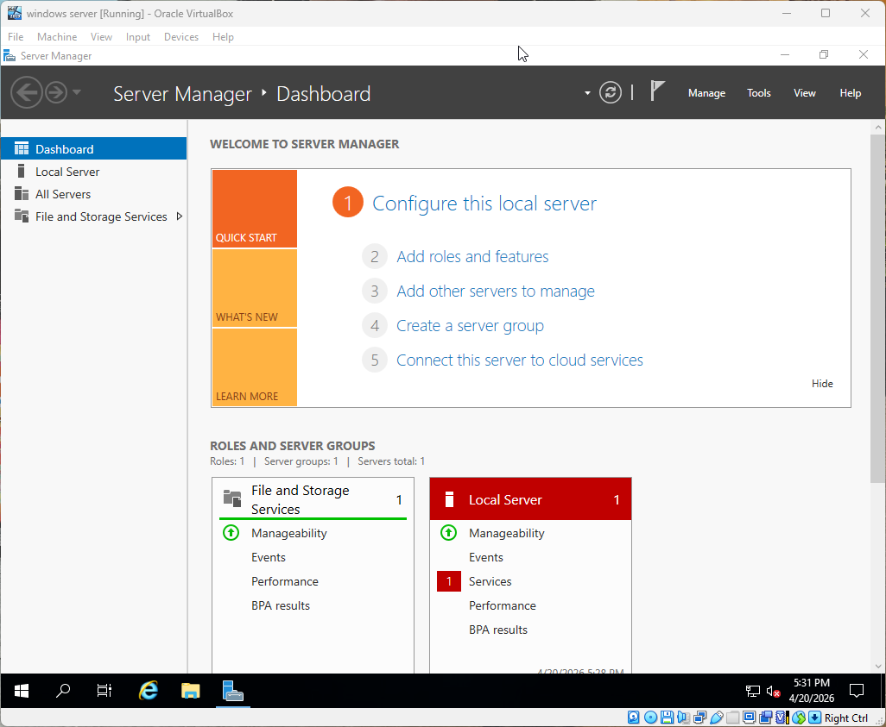
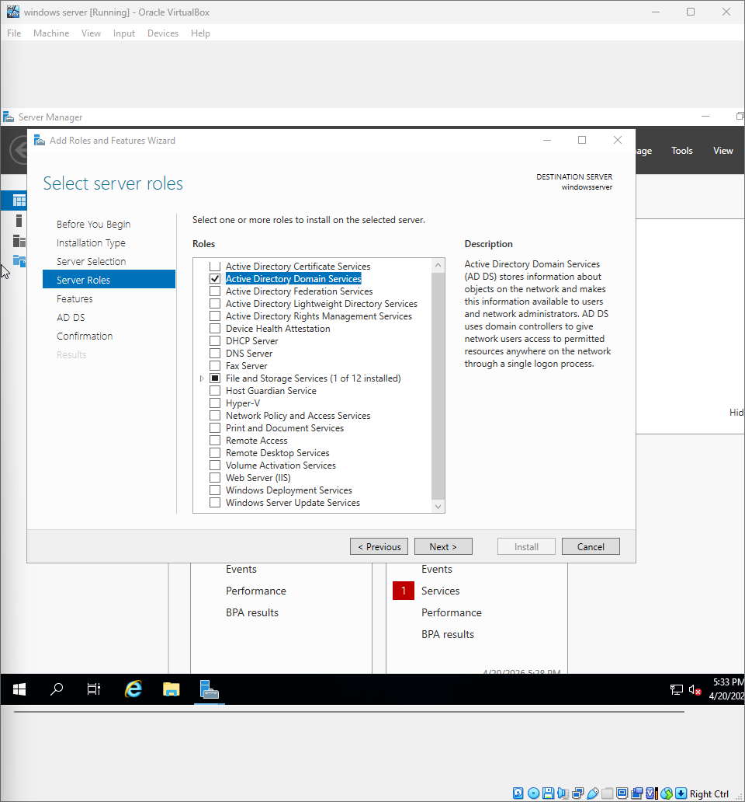
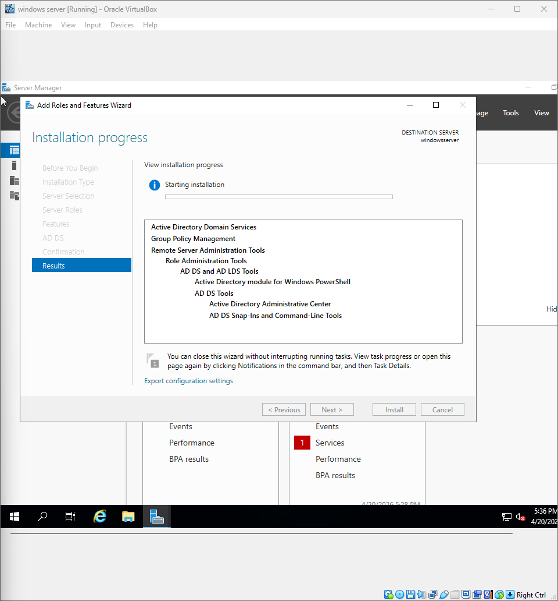
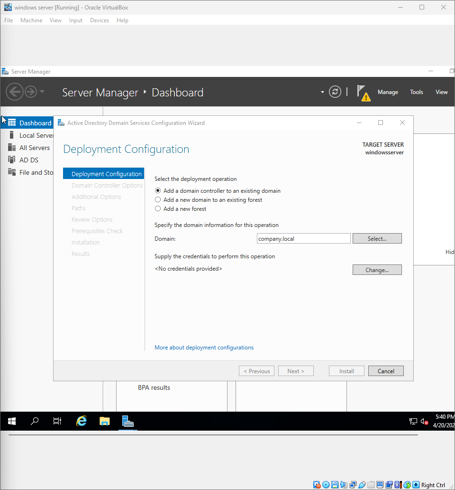
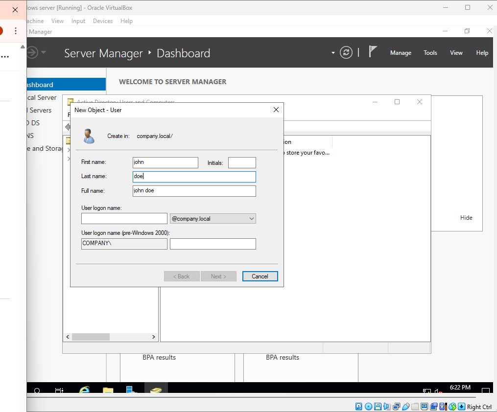
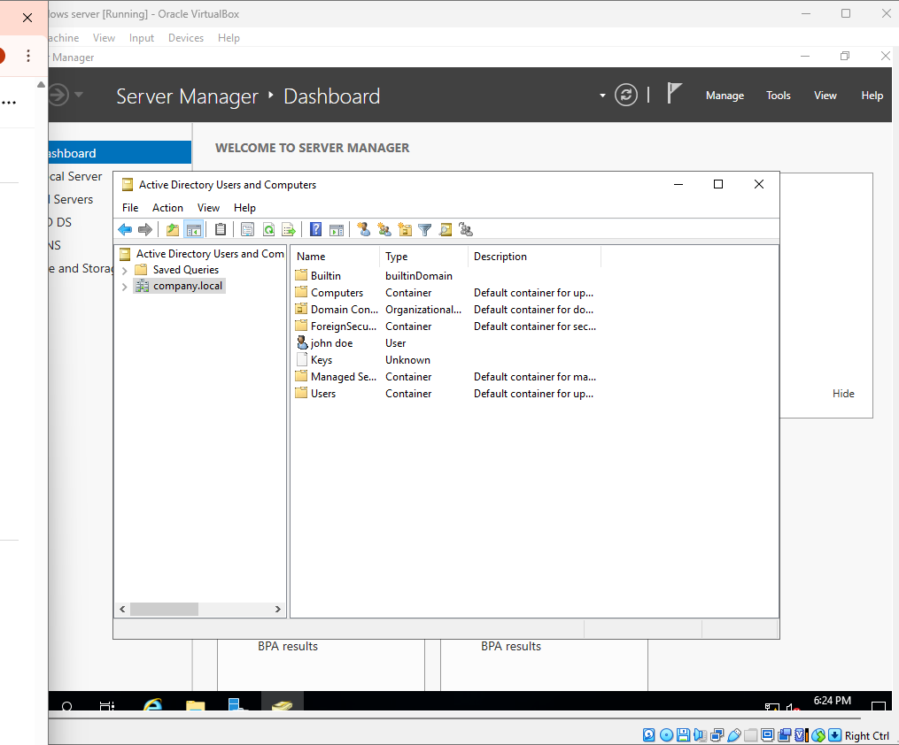
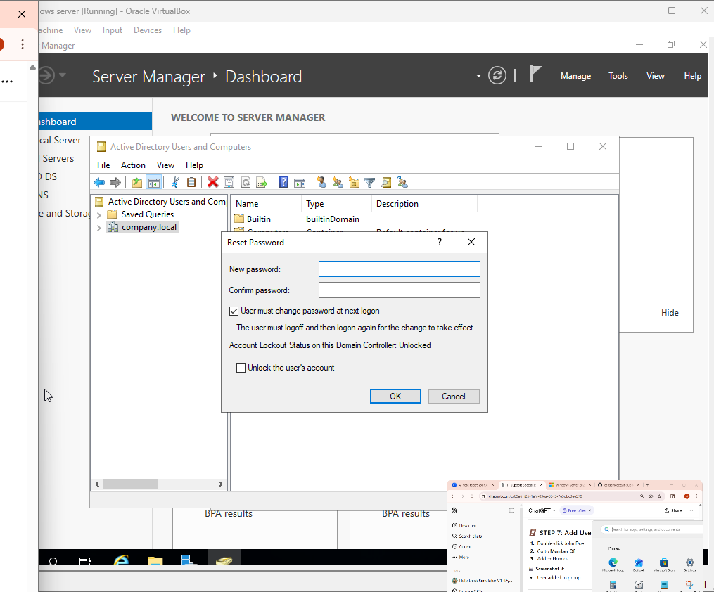

Step 1: Open Server Manager
Description: Once you’re in Server Manager, you can begin by selecting "Add roles and features."

Step 2: Select Active Directory and Domain Services
Description: When you select Active Directory and Domain Services, verify the selection and click Next to continue with the configuration.

Step 3: Show Installation Progress of Active Directory Domain Services
Description: Monitor the installation progress as Active Directory Domain Services is being installed. Once complete, proceed to the next step.

Step 4: Promote Server to a Domain Controller
Description: Begin the process to promote the server to a domain controller. Follow the wizard steps to configure the domain name and other settings.

Step 5: Add User and Set Password
Description: In the Add User window, enter the user details and specify a secure password.

Step 6: View Created User in Manager
Description: Verify that the user you created is displayed in the manager.

Step 7: Create a Group Called Finance
Description: In the group management section, create a new group named "Finance" and define any group settings or permissions as needed.

Step 8: Reset User Password
Description: Navigate to the user settings and initiate a password reset process. Enter a new secure password for the user.

